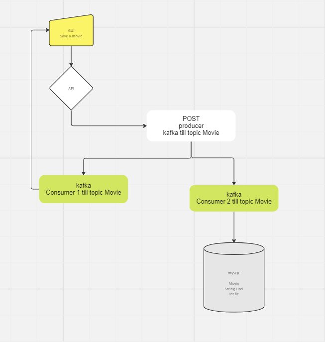
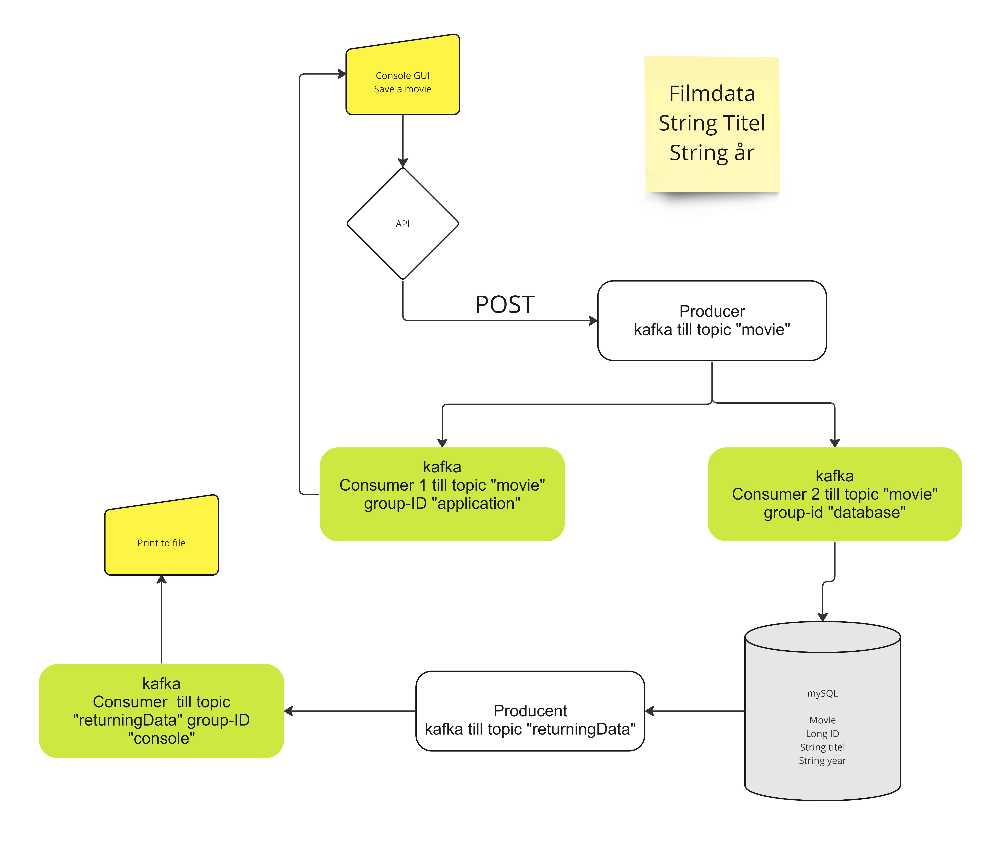
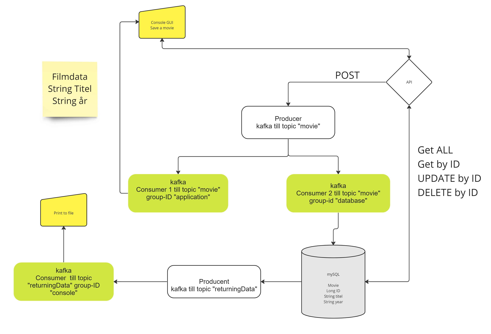

# Projektrapport

### Ert namn
Emil Sivertsson

### Beskrivning av projektet
Uppgiften var att vi skulle skapa en java applikation som skickar information till ett REST API som sedan skickar informationen till en Kafka Producer.\
Kafka Producer skickar informationen till två olika Kafka Consumers.\
Den ena Consumer är original- java applikationen som skriver ut informationen till användaren.\
Den andra consumern skriver informationen till en databas.\
jag valde att bygga ut projektet och la till en producer som skickar informationen vidare efter att den sparats i databasen, \
till en tredje consumer som skriver ut informationen till en fil.\
Jag byggde även ut APIet för att tillåta CRUD funktionalitet.\

### Vad du har gjort
Jag har skapat ett Huvudprojekt som innehåller 4 moduler.\
Alla moduler är Spring Boot Maven applikationer som startat på vars en port.\
Jag ville bygga det i separata moduler för att simulera löskopplade applikationer som kommunicerar med varandra.\
jag har skrivit modulerna och sedan skrivit tester och även satt upp för att använda 3 brokers och replikering i Kafka.\

Jag börjde med en plan som var för en MVP, alltså det minsta som projektet krävde.\

Efter det planerade jag för hur jag skulle bygga ut projektet med mer utmaningar.\

Jag skrev sedan en plan för hur jag skulle bygga ut projektet för att få till den funktionalitet jag ville ha.\

## Arbetet och dess genomförande
Jag började med att skriva APIet och testade det med Postman.\
sedan skrev jag den första API producern som skulle skicka informationen till Consol-consumer och till databasen-consumer.\
Jag skrev sen de båda consumer applikationerna och testade att de fungerade med hjälp av en logger.
Efter det skrev jag Databaskopplingen och dess Entity klass med JPA och testade att den fungerade med hjälp av Mysql Workbench.\
Jag skrev sen Console-applikationen som skulle skicka informationen till APIet och slutligen få tillbaka informationen.
Jag lade sedan till en producer som skulle skicka informationen till en tredje consumer som skriver ut informationen till en fil.\
Jag lade sedan till funktionalitet för att köra 3 brokers och replikering över flera topics i Kafka.\
Jag la även till funktionalitet för att kunna göra CRUD operationer på databasen via APIet.\
Sist skrev Jag tester och även testat DiffBlue på en del av koden för att testa om autogenerated tester fungerar.\

### Vad som varit svårt
Jag hade ett problem som tog lång tid att hitta, och det var att jag hade skrivit fel i min application.properties fil.\
jag hade Jsondeserializer istället för stringdeserializer, vilket gjorde att mina utskrifter blev helt fel, och jag kunde inte spara till databasen\
eftersom det inte gick att Parsa.\
Jag fick till slut ta hjälp av min klasskamrat för att leta reda på problemet.

### Beskriv om du fått byta lösning och varför i sådana fall
Min första tanke var att använda ett JavaFX GUI för att ta input från användaren och visa en lista på alla filmer.\
men det visade inte fungera, för javaFX har en egen launch() funktion som inte fungerar med Spring Boot.run metoden\
Utan Spring, så funkar inte @annoteringarna, och då laddade inte @Kafkalistner de inkommande meddelandena.
Jag lärde mig sen av Kristoffer Larsson att man kunde göra det i en stort separat tråd., men det var inte på det sättet jag hade tänkte mig funktionaliteten.
Så jag skrotade det och skrev om till en vanlig consol GUI som gjorde samma sak.\

Från början gjorde jag en separat modul som höll Entity,DTO och repository classer som de andra modulerna kunde använda,\
men detta visade sig inte funka vid Build, så jag fick lägga till dem i de andra modulerna istället.\
Det blev lite stökigare med "samma" filer på olika platser, men om man tänker att de är helt separata applikationer så känns det rimligt.

## Slutsatser

### Vad gick bra
Projektet överlag. Jag gjorde en grov planering innan jag började, och det gick bra att följa den.\
Jag fick till det mesta som jag ville, och jag fick även till en del extra funktionalitet som jag inte hade tänkt mig från början eftersom 
jag hade tid kvar.\

### Vad gick dåligt
Jag ville fått till en snyggare Consol, om vi hade hämtat informationen via Apiet så hade min ide med ett javaFX fönster funkat,\
men som det var nu så får jag dyka ner i lite mer kurser om web, så jag kan får till något mer HTML och javascript baserat.\

### Vad har du lärt dig
Jag har lärt mig använda Apache Kafka för att skicka information mellan olika applikationer.
Jag har även fördjupat min kunskap inom Springboot med Hibernate, JPA och hur man jobbar med separate moduler i Spring Boot.

### Vad hade ni gjort annorlunda om ni gjort om projektet
Jag hade velat gått djupare ner i kafka, och lärt mig mer om Connect och Streams, men jag har inte hittar någon bra kurs än.

### Vilka möjligheter ser du med de kunskaper du fått under kursen.
Väldigt många, denna kursen är den som fått upp mina ögon för vad vi faktiskt kan bygga, inte bara en "stand-alone" application i java.
Interaktion mellan services och applikationer är något jag verkligen ser framemot!