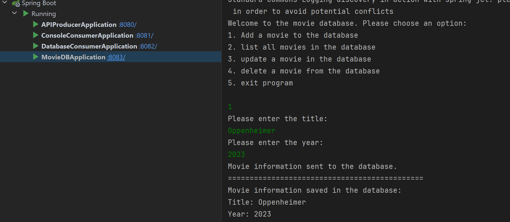

# Your favorite movies!

### A SpringBoot, Rest API, Kafka and MySQL project

## Table of Contents
- [Description](#Description)
- [What was your motivation?](#What-was-your-motivation)
- [Installation and Usage](#Installation-and-Usage)
- [Dependencies](#Dependencies)
- [Credits](#Credits)
- [Tutorials](#Tutorials)
- [License](#License)
- [Tests](#Tests)

## Description
This is a School projekt for the course in Integration plattforms. it consists of several moduls.
- A Console interface module that takes the users input and sends it to a Rest API as a Json String \
  and serves as a consumer for a kafka topic. it also allows the user to preform CRUD operations on the database, via the API.
- A REST API modul that serves as a Kafka producer and sends the Json String to a Kafka topic.
    The API also has basic CRUD functionality for the database.
- A Console/writer module that serves as a Kafka consumer that receives the Json String and writes its information to a TXT-file.
- A database module that serves as a Kafka consumer that receives the Json String and saves it to the database. \
    It also serves as a Kafka producer and sends the information from the database to the writer module.

## What was your motivation?
Our assignment was to create a Rest API that takes the users input and sends it to a Kafka topic.\
Then we were supposed to create a Kafka consumer that takes the Json String and prints its information to the user in the original application.\
We were also supposed to create a Kafka consumer that takes the Json String and saves it to a database.\
I wanted to take it a step further and create a JavaFX application that takes the users input and sends it to the Rest API as a Json String.\
I learned a lot from this project , and I can see the benefits of using Kafka in a project with multiple applications \
and microservices that needs to communicate with each other.\
I also extended my knowledge about Spring boot and APIs, witch I have used before but not to this extent.\

## Installation and Usage
Important!
if you don't have a local MySQL database and a local Kafka server running on your computer, the application will not start.\
you will get an error message that the application cant connect to the database or that the brokers is not available.

1. To use the application you need to have a local MySQL database running on your computer.
   - Download MySQL Community from https://dev.mysql.com/downloads/installer/ and install it.
   - When you have installed MySQL Community you need to create a database called "movies".
   - The application uses password "root" and username "root" to connect to a local MySQL database.
   - please alter the password and username in the application.properties file in the MovieDBApplication, if yours not the same.
   
- You could also mount a Docker image of mySql, for help on how to do this please see the Docker homepage,\ or this tutorial https://youtu.be/kphq2TsVRIs?si=wS20hxnnLG2CAxr4

2. You also need to have a local Kafka server running on your computer.
   - Download Kafka from https://kafka.apache.org/downloads and install it.
   - When you have installed Kafka you need to run the Zookeeper and Kafka server.
   - Please see the information on the homepage on how to do this.
   - you need to copy three files from the folder "Brokers" to the config directory in the Kafka folder on your computer.
     - server.properties
     - server2.properties
     - server3.properties
   - start your Zookeeper and the three Kafka servers (Brokers), information on how to do this for your system can be found on the Kafka homepage.
   - its very important that you start them before you start the applications, or else the applications you will get an error that the replication factor don't have enough brokers.
   
- This could also be done as a docker image, for help on how to do this please see the Docker homepage,\ or this tutorial https://youtu.be/2sTCZeREs8w?si=dOLSi7sNWxbtHt5_ 

3. Clone this repository to your computer and open it in your IDE.
   - First run the Rest API application.
     - This will start on port 8080, start the API that serves as a Producer for the Topic "movie". 
   - Second run the Console Consumer application.
     - This will start on port 8081, starts an application that serves as a Consumer for the Topic "returningData", with the group-id "Console".
     - Its function is to write the information from the topic into a local file.
   - Third run the Database Consumer application.
     - This will start on port 8082, starts an application that serves as :
       - a Consumer for the Topic "movie", with the group-id "Database". The information from the Topic is saved to the database.
       - a Producer for the Topic "returningData". The information from the database is sent to the Topic.
   - Fourth run the MovieDBApplication.
     - This will start on port 8083, starts an application that takes the users input, sends it in a POST request to the Rest API as a Json String.
     - It also serves as a Consumer for the Topic "movie" group-id "Application". The information from the Topic is printed to the user.
   

When entered the information in the MovieDBApplication you will get the information printed back via the Kafka Consumer.\
you can also see the information in the database.\
The information from the Database also gets printed to the user via the Console Consumer.\

### If installed correctly this is what you should see when you run the applications:

## Replication and participation over several brokers
The application uses three Kafka servers (Brokers) to replicate the information sent through the Kafka topics.\
One of the Brokers will serve as the leader for a partition and the other two will serve as followers.\ if the leader goes down one of the followers will take over as leader.\ this does take a few seconds, and the application will not be able to send or receive information during that time.\
Each topic uses the replication factor 3 and the partition factor 3, so that the information will be replicated over all three brokers three times.\
The Replication is a fail-safe if one of the brokers goes down, the information will still be available on the other brokers and other partitions.\

## Efficient data usage
I could have more efficiently only used one topic for the application to send to all the consumers, \
but I wanted to add more producers, consumers and topics the make the application more complex.\
To have the data replicated over several brokers demands more data usage, but it also makes the application more fail-safe.\
and Kafka is designed to handle large amounts of data, so I think it's a good trade-off.\

## Dependencies
All dependencies are included in the pom.xml file.
- Java 17
- org.springframework.boot
- org.springframework.kafka
- org.projectlombok
- org.springframework.boot
- spring-boot-starter-data-jpa 
- org.springframework.boot 3.1.2 
- org.springframework.kafka 
- com.google.code.gson 2.10.1 
- org.apache.httpcomponents 4.5.13 
- org.junit.vintage 5.9.3
- com.mysqlmysql-connector-j 8.0.33

## Credits
- my classmates Kristoffer and Johan for prof-reading my code and checking that I did not miss anything.
- chatGPT and Bard for helping me when I got stuck.
- Diffblue for helping me with the tests for the HTTP Connections class.

## Tutorials
- https://youtube.com/playlist?list=PLGRDMO4rOGcNLwoack4ZiTyewUcF6y6BU&si=BByR1u0OqgjQH9TE
- https://youtu.be/EUzH9khPYgs?si=fGigvrOFoLD9ZXpK
- https://youtu.be/B5j3uNBH8X4?si=HF4JNBrfoxOhQD4g

## License
The application is licensed under the MIT license. Please see the license file for more information.

## Tests
I have added tests written with junit, Mockito and Kafka testing.\
the tests for the HTTP Connections class was written using Diffblue, to try out its functionality.

